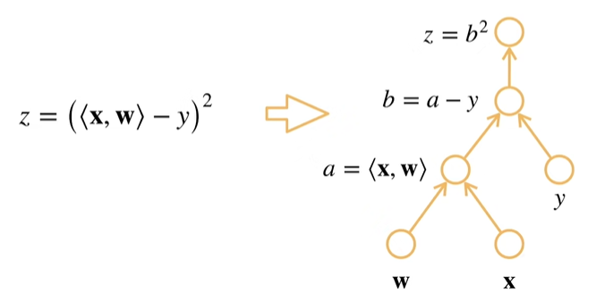

:::important[免责声明]
- **这是一篇笔记**，内容整理自《动手学深度学习》的 PyTorch 版本和该书的[在线课程](https://space.bilibili.com/1567748478)。
- 笔记中对自动微分的解释仅代表个人理解，可能和实际的工程实现不符。
:::

在上一篇笔记中，我们讨论了求导与自动求导的目的。现在我们可以介绍自动求导是如何实现的。

## 计算图

简单来说，计算图是一个表示计算过程的**有向无环图**。

例如 $z = (<\mathbf{x},\mathbf{w}> - y)^2$ 的计算图可以表示为：

为了进行自动求导，机器学习框架会先将描述计算过程的代码分解为操作子，然后解析为计算图。

对于 PyTorch 而言，它可以跟踪**指定的** n 维数组所参与的运算过程，在计算过程中**隐式地**构造一个计算图，并**记录下必要的中间变量值**。

在其它一些框架中可以**显式地**手动构造计算图，如 TensorFlow 和 MXNet。

## 链式法则

自动求导也使用链式法则，将复合函数的导数拆分为一系列中间变量间的导数的乘积来求解。

计算图的作用之一，就是让框架确定所求导数可以拆解为哪些中间变量的导数。

在上面的例子中，你可能想要求结果 $z$ 关于 $\mathbf{w}$ 的导数（梯度）。

可以看到，计算图已经将它拆解为三层复合：

$$
\begin{cases} z=b^2, \\ b=a-y \\ a=<\mathbf{w},\mathbf{x}> \end{cases}
$$

由此可以将所求导数表示为（这里使用**分子布局**）：

$$
\frac{\partial z}{\partial \mathbf{w}} = \frac{\partial z}{\partial b} \frac{\partial b}{\partial a} \frac{\partial a}{\partial \mathbf{w}}
$$

## 求导的顺序

我们是要先完成对 $z$ 的值的计算，再求 $z$ 关于 $\mathbf{w}$ 的导数。

就像之前说的那样，在求 $z$ 的过程中，PyTorch 就会帮我们记录好必要的中间变量的值。

所以，这里自动求导仅仅求出 $\frac{\partial z}{\partial b}$、$\frac{\partial b}{\partial a}$、$\frac{\partial a}{\partial \mathbf{w}}$ 的解析式：

$$
\begin{cases} \frac{\partial z}{\partial b} = 2b, \\ \frac{\partial b}{\partial a}=1, \\ \frac{\partial a}{\partial \mathbf{w}}=\mathbf{x},\end{cases}
$$

然后分别将所需的中间变量代入，求出这三个导数值，再将它们乘起来，求得导数的值。

:::note[说明]
我们不必进一步将 $\frac{\partial z}{\partial \mathbf{w}}$ 的解析式化成仅含自变量的形式。我们要的是导数的值，未必要求出导函数关于自变量的解析式。如果函数变得更加复杂，做符号化简会带来不必要的开销（毕竟这是符号运算，不是数值运算，而且复杂函数的导函数解析式甚至未必能写出来）。
:::

要代入求值，我们得把需要的变量先读出来。这就有个问题：**我们应该按什么顺序读取变量**？换句话说，我们先算哪个导数值？这个问题在自变量和中间变量数目极多时会变得尤其重要。

计算图的作用之二就是帮助我们确定这个顺序。

我们可以按计算图去遍历所需的中间变量，这是一种比较自然的方式。

我们采取**反向累积**（又称**反向传播**）的方式进行计算。简单来说，我们计算的顺序与计算图的箭头方向相反：

- 先读取 $b$，求得 $\frac{\partial z}{\partial b}$；
- 读取 $\frac{\partial b}{\partial a}$（因为是常数，不用代入计算）将它乘到 $\frac{\partial z}{\partial b}$ 的结果上，得到 $\frac{\partial z}{\partial a}$；
- 再读取 $\mathbf{x}$，求得 $\frac{\partial a}{\partial \mathbf{w}}$，将它乘到先前的结果上，求得 $\frac{\partial z}{\partial \mathbf{w}}$。

:::note[疑问]
可能是缺少必要的离散数学知识和算法知识，我暂且没想明白正向累积和反向累积在「计算顺序」上的区别背后的实质是什么，也搞不清楚两种方式在计算复杂度上的差异。我可能会在未来补充有关这里的内容。
:::

---

## 参考文献

1. Zhang A, Lipton Z C, Li M, et al. Dive into Deep Learning. Cambridge University Press, 2023. [https://D2L.ai](https://D2L.ai).
2. Li M. (2021). Introduction to Deep Learning in Chinese. D2L Courses. [https://courses.d2l.ai/zh-v2/](https://courses.d2l.ai/zh-v2/).